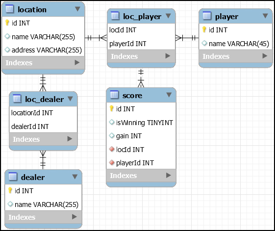

# Let's Play War

## Technologies (3-tier architecture)
> * **Front-end**: **React-Redux** (built with: "**create-react-app**"),
> * **Back-end**: **Express/NodeJS**,
> * **Database**: **SQL** (with **Sequelize** as ORM).

## SQL Schema

> * **Location**: where the "***war***" happens
> * **loc_player**: just the intermediate table of a **n-m** relationship (between "***location***" and "***player***")
> * **Player**: player's information
> * **score**: record of result for all players

## How to Play?

> The dealer gives a card for each player and against each player, he (she) has his (her) own card. Result:
> * If the card of the player is better, he (she) takes his card and the one of the dealer,
> * If it is tie, the player takes his (her) card and the dealer does the same with his (hers),
> * If the dealer's card is better, he (she) takes his card as well of the one of the player that lost
> 
> After 10 rounds, the player(s) with the most cards is (are) the winner(s).  

## How to Run the App?
### Database
> * Create the database with the name "**lets_play_war**"
> * Create a file "**config.js**" containing the password for the database with only a line:
>                      ***module.exports = { db_pwd: <THE_PASSWORD_TO_YOUR_DATABASE> };***

### Server
> In a terminal: "**npm run build**"
---

# Let's Play War (requirements)
## Purpose
The purpose of this project is to not only test your ability to solve a problem, but also understand how you go about solving a problem. You do not need to complete this project, but the closer you get the easier it is to evaluate. Once you feel you have done enough we will review your results and talk about what decisions you made and why. It is more important to speak to why you made a decision than making the "right" choice.

## Business Requirements
There is a simple card game called [war](https://www.bicyclecards.com/how-to-play/war/). You will create a playable version of this game, with some modifications:
1. Instead of dividing one deck and distributing them evenly to the players, the dealer will hold onto all the cards.
2. The dealer will play with 4 decks and shuffle all 4 decks together so we will have 4 of every card mixed into 4 decks.
3. For simplicity, if there is a tie the dealer and player will take their respective cards.
4. Instead of dealing all the cards, after 10 rounds a winner is declared (the person with the most cards).
5. Multiple players can play at the same time against the dealer. _Players don't play each other_.
6. Each player will initiate the round by asking the dealer to deal one card for the player and one card for the dealer.
7. Each plater can play as fast or as slow as they wish.
 
## Technical Requirements
1. There is no time limit. Take as long as you think you need.
2. You __must__ use a front-end library or framework such as angular, react, vue, eccetera.
3. You __must__ write a backend component, but you are free to use any language you wish. Here at LOD, we use Java, Golang, and Typescript/JavaScript running on node.js. However, you are free to use whatever language you wish.
4. Please provide details on how to compile and run your example.

## Extra Credit (but not required)
1. Provide at least one unit test for your client code and one unit test for your backend code
2. Use a database to store your data
3. Containerize your application using Docker

## Submit 
Please fork this project and create a PR when you are ready for a review. If you have any questions please create an issue and call me out (@jhorlin) so that anyone else participating can benefit from our Q&A.
